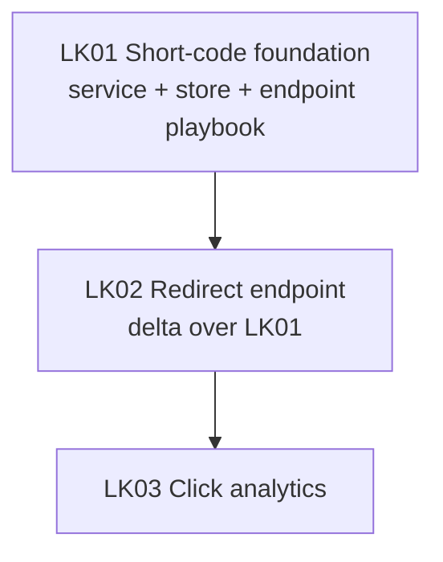

# Linkly delivery tracker

*Dependency graph, status, and parallelism rules for delivering Linkly, the URL shortener
defined in [example-prd](../example-prd/README.md). The PRD owns what/why; each story's spec
owns how; this doc owns sequencing and parallelism. Each story (`LK`n) maps back to the PRD's
acceptance-criteria IDs. A worked-example tracker — copy the shape, not the contents.*

## Context

1. **Why this track exists.** It decomposes [example-prd](../example-prd/README.md) (Linkly)
   into shippable stories. The ship-blockers are `L-1` (submit a long URL, get a short code)
   and `L-2` (a short code 301-redirects to the original); `A-1` (per-link click count) is a
   target.
2. **Audit findings.** This is a greenfield worked example — there is no existing source to
   audit. A real run of `plan-track` would record what its reality audit found here.
3. **What this tracker covers.** Status, ordering, parallelism. Per-story detail lives in each
   story's spec under [`specs/`](./specs/).

## Dependency graph

**Reading the graph:** every solid arrow is a hard dependency — the source story must be `done`
or `verified` before the target starts. LK01 has no inbound edge and can start immediately.

## Status matrix

Statuses: `specced` → `plan-approved` → `implementing` → `done` → `verified` (also `blocked`,
`canceled`, `deferred`, `superseded`). See [tracker-contract](../../references/tracker-contract.md).

| ID | Name | Depends on | Wave | Status | Spec | Plan | Owner | PR |
| --- | --- | --- | --- | --- | --- | --- | --- | --- |
| LK01 | Short-code foundation (L-1) | — | W1 | specced | [spec](./specs/2026-06-02-lk01-short-code-foundation.md) | — | — | — |
| LK02 | Redirect endpoint (L-2) | LK01 | W2 | specced | see LK01 + [delta](./specs/linkly/endpoints/2026-06-02-lk02-redirect-endpoint.md) | — | — | — |
| LK03 | Click analytics (A-1) | LK02 | W3 | specced | — | — | — | — |

LK01 satisfies `L-1`, LK02 satisfies `L-2`, LK03 satisfies the `A-1` target (left unspecced
here — a realistic "not yet detailed" row). The **Plan** column stays `—`; the implementing
session drafts plans.

## Parallelism rules

**Wave 1 — Foundation (single story):** LK01 establishes the short-code service, the link
store, and the endpoint playbook that LK02 follows. It runs alone because everything downstream
depends on it.

**Wave 2 — Redirect pilot/rollout (sequential):** LK02 is the first endpoint built on the LK01
playbook, so it doubles as the pilot — do not start LK03 until LK02 is `done` and the playbook
has absorbed any lessons. The constraint is need-pilot-first plus file contention: LK02 and any
future endpoint stories edit the shared router and store.

**Wave 3 — Analytics (sequential):** LK03 reads the redirect path LK02 establishes, so it
follows LK02.

## ID-prefix registry

This track reserves the prefix **`LK`**. It is recorded in the tracks index (`<tracksDir>/README.md`
in a real repo) and is never reused.

## How to pick up a story

1. Find a row whose **Depends on** are all `done`/`verified` and whose **Status** is `specced`
   or `plan-approved`.
2. Claim it (set **Owner**; isolate per your `git.strategy`) and flip **Status** to
   `implementing`.
3. Read the linked spec; for LK02, read the LK01 playbook plus the delta.
4. Draft a plan under your `plansDir` if none exists.
5. Execute. Flip **Status** to `done` in this table in the same PR.

## Ground rules

- **One story per PR.**
- **One ID prefix per track** — `LK` is reserved here.
- **The PRD is the source of done-ness; the tracker is the source of status.** Never infer
  completion from prose elsewhere.
- **When the LK01 playbook is wrong, fix it in the same PR** as the story that surfaced the gap.

## Related

- [../example-prd/README.md](../example-prd/README.md) — the PRD this track decomposes
- [../../references/tracker-contract.md](../../references/tracker-contract.md) — the tracker contract
- [./specs/](./specs/) — the worked standalone and delta specs
