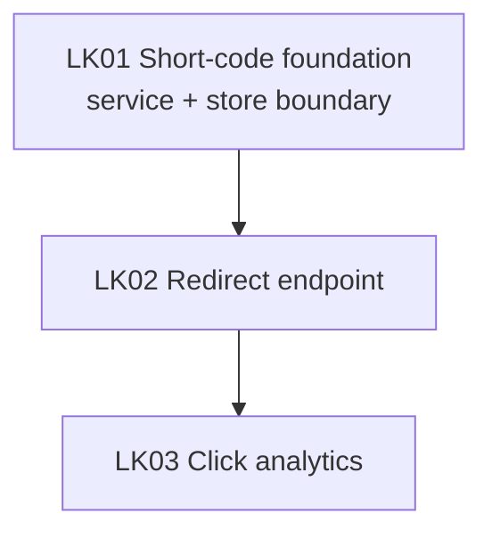

# Linkly delivery tracker

*Dependency graph, status, and parallelism rules for delivering Linkly, the URL shortener defined
in [example-prd](../example-prd/README.md). The PRD owns what/why; this tracker owns sequencing and
parallelism. Each story (`LK`n) has a lightweight brief under [`stories/`](./stories/);
`implement-next` creates the detailed technical story spec and implementation plan before code.*

## Context

1. **Why this track exists.** It decomposes [example-prd](../example-prd/README.md) (Linkly) into
   shippable stories. The ship-blockers are `L-1` (submit a long URL, get a short code) and `L-2`
   (a short code 301-redirects to the original); `A-1` (per-link click count) is a target.
2. **Audit findings.** This is a greenfield worked example. A real run of `plan-delivery-track`
   would record repo docs, source roots, existing trackers, and prefix collisions here.
3. **What this tracker covers.** Status, ordering, and parallelism. Per-story delivery context
   lives in story briefs; implementation detail comes later.

## Dependency graph

**Reading the graph:** every solid arrow is a hard dependency. The source story must be `done` or
`verified` before the target starts. LK01 has no inbound edge and can start immediately.

## Status matrix

Statuses: `specced` -> `plan-approved` -> `implementing` -> `done` -> `verified` (also `blocked`,
`canceled`, `deferred`, `superseded`). See
[tracker-contract](../../references/tracker-contract.md).

| ID | Name | Depends on | Wave | Status | Spec | Plan | Owner | PR |
| --- | --- | --- | --- | --- | --- | --- | --- | --- |
| LK01 | Short-code foundation (L-1) | — | W1 | specced | [brief](./stories/LK01.md) | — | — | — |
| LK02 | Redirect endpoint (L-2) | LK01 | W2 | specced | [brief](./stories/LK02.md) | — | — | — |
| LK03 | Click analytics (A-1) | LK02 | W3 | specced | [brief](./stories/LK03.md) | — | — | — |

The **Plan** column stays `—`; the implementing session drafts plans after creating the detailed
technical story spec.

## Parallelism rules

**Wave 1 — Foundation (single story):** LK01 establishes the short-code service and link store
boundary that LK02 follows. It runs alone because everything downstream depends on it.

**Wave 2 — Redirect (sequential):** LK02 depends on LK01's code-generation/storage boundary and
touches the router.

**Wave 3 — Analytics (sequential):** LK03 reads the redirect path LK02 establishes, so it follows
LK02.

## ID-prefix registry

This track reserves the prefix **`LK`**. It is recorded in the tracks index (`<tracksDir>/README.md`
in a real repo) and is never reused.

## How to pick up a story

1. Find a row whose **Depends on** are all `done`/`verified` and whose **Status** is `specced` or
   `plan-approved`.
2. Claim it and flip **Status** to `implementing`.
3. Read the linked story brief.
4. Create/refine the detailed technical story spec under `docs/superpowers/specs/`.
5. Draft an implementation plan under `docs/superpowers/plans/`.
6. Execute. Flip **Status** to `done` in this table in the same PR.

## Ground rules

- **One story per PR.**
- **One ID prefix per track** — `LK` is reserved here.
- **The PRD is the source of done-ness; the tracker is the source of status.**
- **The story brief is not implementation-ready.**

## Related

- [../example-prd/README.md](../example-prd/README.md) — the PRD this track decomposes
- [../../references/tracker-contract.md](../../references/tracker-contract.md) — the tracker contract
- [./stories/](./stories/) — lightweight story briefs
