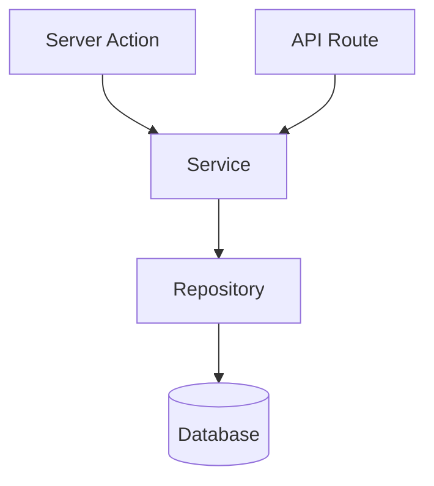

# Docs style

_Every doc under `docs/` must open with a one-line TL;DR, carry required frontmatter, and follow a predictable structure so a reader — human or agent — can orient in under 90 seconds._

## Context

This file is the repo-owned authoring standard. The kit seeds it from the chosen preset; thereafter it is the single authoritative source for how docs are written in this repo. Skills read this file at runtime — they do not hardcode the standard. Edit this file freely to layer your own rules on top of the kit baseline.

The `extends: built-in/recommended` line in the frontmatter signals to skills that your rules extend rather than replace the built-in baseline. Remove it when you want full ownership and no fallback to the built-in defaults.

## Required frontmatter

Every doc must open with a YAML frontmatter block. The following keys are required on every file:

| Key | Type | Description |
|---|---|---|
| `title` | string | Human-readable document title. Must match the H1. |
| `status` | string | Closed vocabulary — see the status table below. |
| `owner` | string | Person or team accountable for keeping this doc current. |
| `last-reviewed` | date (`YYYY-MM-DD`) | Date this doc was last reviewed for accuracy. |
| `related` | list of relative paths | Optional but encouraged. Links to related docs or contracts. |

Example:

```yaml
---
title: Payments domain
status: approved
owner: arye
last-reviewed: 2026-06-18
related:
  - ../guidelines.md
  - decisions/0007-stripe-connect.md
---
```

## Status vocabulary

`status` is a closed vocabulary — do not invent new values. The allowed values are scoped per doc family so the set stays small and unambiguous.

| Doc family | Allowed `status` values |
|---|---|
| Canonical (topic docs, domain references, architecture guidelines) | `draft` · `approved` · `deprecated` |
| ADR | `proposed` · `accepted` · `superseded by NNNN` |
| PRD / technical design | `draft` · `approved` · `shipped` · `archived` |

Notes:

- `superseded by NNNN` is a literal string with the ADR number, e.g. `superseded by 0004`. The number is stable and survives title renames.
- Do not use `WIP`, `v2`, `in progress`, `soon`, or any other informal terms.
- A `deprecated` canonical doc should be left in place with its `status` updated and a note at the top pointing to the replacement. Deletion removes history and breaks inbound links.

## One fact, one place

Each fact lives in exactly one doc. Everywhere else links to it. If you find yourself copying a sentence from another doc, stop and link instead. Duplication creates two sources of truth that drift apart the moment one is updated.

## Structure rules

Every doc follows this order. Sections may be expanded but the sequence below must be preserved:

1. **Frontmatter** — required YAML block as described above.
2. **H1** — matches the `title` frontmatter value exactly.
3. **TL;DR** — one italic sentence directly under the H1. Finishes the thought "If you read only one line, know this: …" A reader who lands here and has 10 seconds must get the core idea.
4. **Context** — two to four sentences. Why does this doc exist? What problem or question does it address? Keep it factual; resist restating the H1.
5. **Body** — the main content. Sections and sub-sections as needed. See per-doc-type structure below for required sections per type.
6. **Related** — a flat list of relative links to the most important sibling docs. Do not reproduce every link from the frontmatter; choose the two to five most useful navigation targets.

Additional rules:

- **Sentence-case headings.** Write `## Enforcing tenant isolation` not `## Enforcing Tenant Isolation`. Only the H1 may use title case, and only when the `title` field uses it.
- **Active voice.** Write "Services call repositories." not "Repositories are called by services."
- **Relative links only.** Write `../decisions/0003-feature-modules.md` not an absolute URL. Relative links survive repo renames and forks.
- **Code fences always carry a language tag.** Use ` ```ts `, ` ```yaml `, ` ```bash `, ` ```sql `, etc. Never use a bare ` ``` ` fence.
- **No binary screenshots of code or data.** Use Mermaid diagrams, fenced code blocks, and tables instead. Real UI screenshots (runbooks, UX docs) are acceptable; screenshots of code or terminal output are not.
- **Descriptive headings.** A reader skimming headings must understand what the section covers without reading it. Write `## Scoping every query to one studio` not `## The guard`.
- **One concept per file.** Split at approximately 400 lines. If a file grows beyond that, extract a focused sub-topic and link to it.
- **Kebab-case filenames.** Examples: `multi-tenancy.md`, `docs-style.md`. No spaces, no underscores.

## Per-doc-type structure

Each doc type has a required section order. Sections may be expanded but not reordered or omitted unless marked optional.

| Doc type | Required sections (in order) |
|---|---|
| Architecture guideline / topic doc | TL;DR · Context · Rule / Design · Examples (at least one do / one don't) · Related |
| ADR (MADR) | Context · Decision · Consequences (Positive, Negative, Neutral) · Alternatives considered · Related |
| Domain reference | Purpose · Public API · Invariants · Gotchas · Related code |
| Master index | Context · Three-pillar table · Reading journey (Mermaid) · "I need to X → read Y" table · Conventions · Related |
| Pillar index (product / architecture) | TL;DR · Context · Start here (2–3 links) · "I need to … → read …" table · Topic listing · Related |
| PRD (per the PRD contract) | Frontmatter with `status` required; PRD contract governs the rest |
| Tracker | Per tracker-contract |
| Runbook | Symptom · Diagnosis · Remediation · Escalation |

Full templates for ADR, domain reference, and the two index types live in `references/templates/` (kit-resolved path, configurable).

## Diagrams

### When to use a diagram

A diagram earns its place only when a prose description would require nested clauses or a sequence of more than three steps. If three short sentences cover it, use prose. When in doubt, write the prose first — if it reads clearly, you are done.

### Diagram type picker

| Situation | Use |
|---|---|
| Request or data flow, module boundaries | `flowchart` |
| Cross-layer or temporal call sequence | `sequenceDiagram` |
| Lifecycle or status machine | `stateDiagram-v2` |
| Data model | `erDiagram` |
| System context, bounded services | `C4Context` |

Use Mermaid for all committed docs. Mermaid is diffable, agent-readable, and rendered natively by GitHub. Do not commit rendered SVG or PNG screenshots of diagrams — they cannot be reviewed or updated in a text diff.

### Preamble → diagram → takeaway rule

Every diagram must be wrapped by:

1. A **preamble** — one sentence immediately before the diagram block stating what to look for.
2. The **diagram** itself.
3. A **takeaway** — one sentence immediately after stating the conclusion the reader should draw.

Example:

The two entry points both reach the repository through the service layer; neither calls the repository directly.



The diagram confirms there is no path from an entry point to the repository that bypasses the service.

## Extending this standard

This file declares `extends: built-in/recommended` in its frontmatter. That signals to kit skills that the rules here layer on top of the kit's built-in baseline rather than replacing it entirely. Skills fall back to built-in defaults only for rules not present in this file.

To take full ownership and disable the fallback: remove the `extends` line.

To add repo-specific rules: add new sections below `## Extending this standard`. Kit skills that read this file will apply them in addition to the rules above.

## Related

- `references/templates/adr-template.md` — ADR template (MADR)
- `references/templates/domain-reference-template.md` — domain reference template
- `references/templates/index/master-readme-template.md` — master index template
- `references/templates/index/pillar-readme-template.md` — pillar index template
