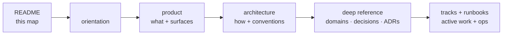

# Documentation map

_Start here. This page explains how the `docs/` tree is organized and points you to the right pillar for whatever you need to know._

## Context

<Two to three sentences describing the project and its docs organization. Who is this documentation for? What are the two or three things a reader absolutely must know to orient?> New here? Read `<overview or onboarding doc>` first — it is the five-minute orientation.

## The three pillars

Every doc belongs to one of three pillars or one of the operational areas listed below. The pillars answer different questions about the same system.

| Pillar | Question it answers | Where |
|---|---|---|
| **Product** | _What_ are we building, for whom, and what is its current state? | [product/](product/README.md) |
| **Architecture** | _How_ is it built — decisions, layering, data model, conventions? | [architecture/](architecture/README.md) |
| **<Third pillar, e.g. Design>** | _<What question does it answer?>_ | [<path/README.md>](<path/README.md>) |

Two operational areas sit alongside the pillars:

- **Tracks** ([tracks/](tracks/)) — active delivery trackers. Each track has a status matrix, a dependency graph, and per-story specs.
- **Runbooks** ([runbooks/](runbooks/)) — operational procedures for recurring situations (incidents, deploys, data repairs).

> If your repo uses only two pillars or has different operational areas, adjust the table and list above. Delete the third pillar row or add more rows as needed; the structure is a recommendation, not a constraint.

## The reading journey

Read in this order; each layer assumes the one before it.

A first-time reader should stop after `product` to understand the shape of the system. A contributor about to touch code continues through `architecture` and the deep reference.

## "I need to X" → read Y

Fill this table with the questions that actually come up in your repo. Keep it to the 10–15 most common lookups; the pillar indexes carry the full catalog.

| I need to know… | Read |
|---|---|
| What `<project>` is, in five minutes | [`<overview.md>`](<overview.md>) |
| What each surface does and its current state | [`product/README.md`](product/README.md) |
| The authoritative feature requirements | [`product/prds/`](product/prds/README.md) |
| How the system is built (stack, topology, layering) | [`architecture/system-overview.md`](architecture/system-overview.md) |
| The canonical coding rulebook | [`architecture/guidelines.md`](architecture/guidelines.md) |
| The full architecture index | [`architecture/README.md`](architecture/README.md) |
| An architectural decision and why it was made | [`architecture/decisions/`](architecture/decisions/) |
| The contract for a specific domain | [`architecture/domains/`](architecture/domains/) |
| What is actively being built right now | [`tracks/`](tracks/) |
| How to write a doc in this repo | [`architecture/docs-style.md`](architecture/docs-style.md) |
| `<Add rows for your most common lookups>` | `<relative link>` |

## Conventions

Every doc under `docs/` follows [`architecture/docs-style.md`](architecture/docs-style.md): required frontmatter, a one-line TL;DR under the H1, sentence-case headings, relative links, and one concept per file. When a fact lives in one place, everywhere else links to it rather than duplicating.

## Related

- [`<overview.md>`](<overview.md>) — project at a glance
- [`architecture/guidelines.md`](architecture/guidelines.md) — the rulebook; on conflict, it wins
- [`architecture/docs-style.md`](architecture/docs-style.md) — how these docs are written
