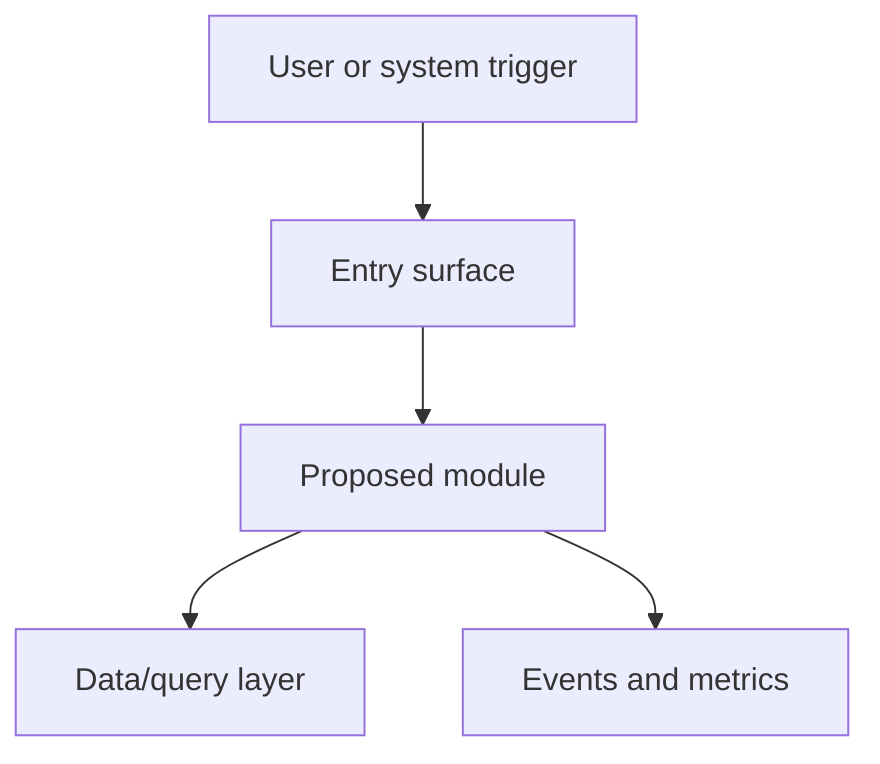

# Technical architecture template

Save at `<prdsDir>/<slug>/architecture.md` (`<prdsDir>` resolves from `paths.prdsDir`,
default `docs/prds`).

---

```markdown
---
title: <Product name> technical architecture
status: approved
owner: <name or "—">
last-reviewed: <YYYY-MM-DD>
related:
  - <path to PRD README>
---

# <Product name> technical architecture

**Source PRD:** <path to PRD README>
**PRD acceptance criteria:** <PRD acceptance criteria IDs>

## Context and existing surfaces

Summarize the PRD scope, existing system surfaces, affected files, current docs, constraints, and
safe assumptions.

## Technical requirements

| Requirement | PRD criteria | Technical bar | Notes |
| --- | --- | --- | --- |
| <requirement> | <PREFIX-n> | <observable technical condition> | <assumption or constraint> |

## System architecture diagram



## Proposed modules/components

| Module/component | Responsibility | Inputs | Outputs | Dependencies |
| --- | --- | --- | --- | --- |
| <module> | <responsibility> | <inputs> | <outputs> | <dependencies> |

## Data/query design

Describe schemas, migrations, query patterns, indexes, caches, retention, backfills, and consistency
rules. If there is no data change, state "No data/query changes."

## AI prompts/triggers/tools

Describe prompts, prompt variables, retrieval context, tools, triggers, safety checks, evaluation
hooks, and fallback behavior. If AI is not in scope, state "No AI prompt/trigger/tool changes."

## Observability/events/metrics

| Signal | Type | Purpose | Owner/consumer |
| --- | --- | --- | --- |
| <event or metric> | <event/metric/log/trace/alert> | <what it proves> | <who uses it> |

## Migration/deploy surfaces

Describe feature flags, rollout order, migrations, backfills, compatibility windows, rollback, and
cleanup.

## Testing strategy

| Test layer | Scope | Command or gate | PRD/architecture coverage |
| --- | --- | --- | --- |
| <layer> | <scope> | <command> | <criteria and <architecture section IDs>> |

## Open technical questions

| Question | Blocking? | Recommended default | Resolution path |
| --- | --- | --- | --- |
| <question> | <yes/no> | <default> | <how it will be answered> |

## Inputs for delivery tracker/per-story specs

| Story/spec input | PRD criteria | Architecture sections to cite | Sequencing/file-contention notes |
| --- | --- | --- | --- |
| <story/spec inputs> | <PREFIX-n> | <architecture section IDs> | <dependency or contention> |
```
