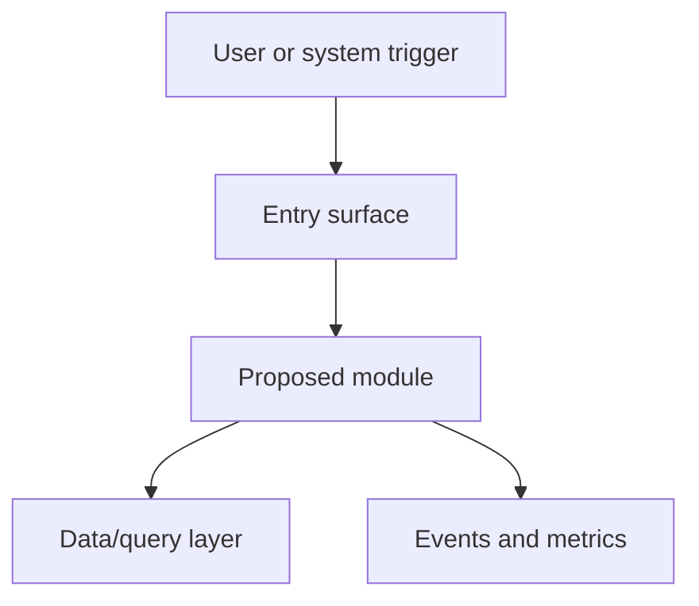

# <Product name> technical solution

**Source PRD:** <path to PRD README>
**PRD acceptance criteria:** <PRD acceptance criteria IDs>

## Context and existing surfaces

Summarize the PRD scope, existing system surfaces, affected files, current docs, constraints, and
safe assumptions.

## Assumptions

| Assumption | Evidence | Revisit when |
| --- | --- | --- |
| <safe assumption> | <PRD/design notes/session context> | <condition that would change it> |

## Technical requirements

| Requirement | PRD criteria | Technical bar | Notes |
| --- | --- | --- | --- |
| <requirement> | <PREFIX-n> | <observable technical condition> | <assumption or constraint> |

## System architecture diagram

## Proposed modules/components

| Module/component | Responsibility | Inputs | Outputs | Dependencies |
| --- | --- | --- | --- | --- |
| <module> | <responsibility> | <inputs> | <outputs> | <dependencies> |

## Data/query design

Describe schemas, migrations, query patterns, indexes, caches, retention, backfills, and consistency
rules. If there is no data change, state "No data/query changes."

## AI prompts/triggers/tools

Describe prompts, prompt variables, retrieval context, tools, triggers, safety checks, evaluation
hooks, and fallback behavior. If AI is not in scope, state "No AI prompt/trigger/tool changes."

## Observability/events/metrics

| Signal | Type | Purpose | Owner/consumer |
| --- | --- | --- | --- |
| <event or metric> | <event/metric/log/trace/alert> | <what it proves> | <who uses it> |

## Migration/deploy surfaces

Describe feature flags, rollout order, migrations, backfills, compatibility windows, rollback, and
cleanup.

## Testing strategy

| Test layer | Scope | Command or gate | PRD/solution coverage |
| --- | --- | --- | --- |
| <layer> | <scope> | <command> | <criteria and <technical solution section IDs>> |

## Open technical questions

List only genuinely blocking questions in the table before approval. Treat this as the **Blocking
technical questions** checkpoint; non-blocking follow-ups should include a safe default and a
resolution path.

| Question | Blocking? | Recommended default | Resolution path |
| --- | --- | --- | --- |
| <question> | <yes/no> | <default> | <how it will be answered> |

## Canonical impact

_Enumerate every canonical doc this design will create or change when it is promoted at track
completion. This list seeds the terminal promote story._

| Doc | Action | Notes |
| --- | --- | --- |
| `<canonical doc path>` | `create` \| `update` \| `new-adr` \| `archive` | <one-line description of the change> |

If no canonical doc changes are expected, replace the table with: "No canonical doc changes —
this design is self-contained and leaves no durable decisions."

## Inputs for delivery tracker/story briefs

| Story brief input | PRD criteria | Technical solution sections to cite | Sequencing/file-contention notes |
| --- | --- | --- | --- |
| <story brief inputs> | <PREFIX-n> | <technical solution section IDs> | <dependency or contention> |
